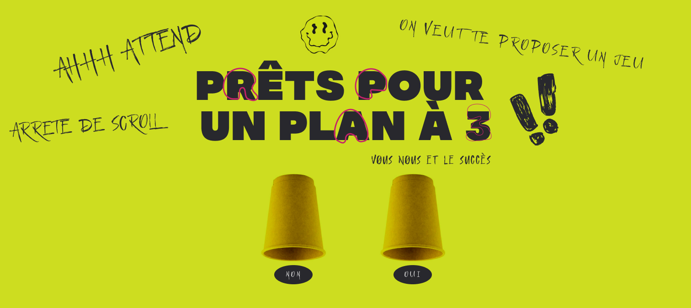

# The Threesome Project

## Description

**The Threesome Project** est une démonstration d'interface interactive visant à présenter mes compétences en développement front-end. Le projet a été réalisé dans le cadre d'un test technique pour montrer ma capacité à reproduire fidèlement une maquette fournie, tout en utilisant des technologies modernes.



### Fonctionnalités principales

-   Animation de texte lettre par lettre.
-   Simulation de mélange de gobelets avec GSAP.
-   Révélation du texte caché sous un gobelet au clic.

## Démo

Le projet est déployé sur Vercel : [the-threesome-project.vercel.app](https://the-threesome-project.vercel.app)

## Technologies utilisées

-   **PNPM** : Gestionnaire de paquets pour installer les dépendances.
-   **Next.js** : Framework React pour la génération de pages côté serveur et côté client.
-   **TypeScript** : Superset de JavaScript pour une meilleure gestion des types.
-   **Sass** : Préprocesseur CSS pour une gestion avancée des styles.
-   **GSAP** : GreenSock Animation Platform pour les animations fluides et performantes.

## Installation

1. Clonez ce dépôt sur votre machine locale :

    ```bash
    git clone https://github.com/just3mpty/the-threesome-project.git
    ```

2. Installez les dépendances avec votre gestionnaire de paquets (PNPM recommandé) :
    ```bash
    pnpm install
    ```
    ```bash
    npm install
    ```
    ```bash
    yarn install
    ```

## Déploiement

Le projet est actuellement déployé sur Vercel. Pour toute modification ou mise à jour du déploiement, il suffit de pousser les changements vers le dépôt GitHub, et Vercel s'occupera automatiquement du déploiement continu.

## Remarques

Ce projet ne contient aucun test automatisé. Les fonctionnalités principales sont les animations et l'interaction avec l'interface utilisateur, réalisées avec Next.js, GSAP et TypeScript.
